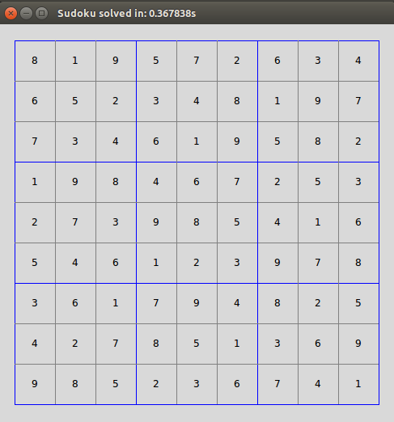

# Sudoku Solver

A simple sodoku solving application that implements the backtrack algorithm.

More efficient algorithms may be added in the future.

## Usage

`main.py` takes in a single `.csv` filename as a command line argument. If the program successfully solves the puzzle, the solution 
will be displayed in a TK GUI with the time taken to solve in the title.

The CSV file should contain 0's to represent blank cells.


Terminal:

```
python3 src/main.py hard.csv
```


